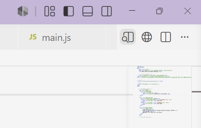
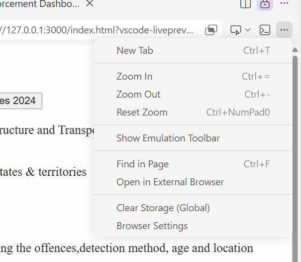

# Project Title & Description
 
# 1. Name of Dashboard :
Road Safety Enforcement Dashboard

# Brief Description of what it does and what datasets it uses:

This dashboard visualises road safety enforcement data across Australia. It shows which age groups test positive for different drug types under each jurisdiction, the types of offences and how fines are detected (such as by camera or police-issued tickets), and road death trends from 2014 to 2025 including the age groups and speed zones involved. The aim is to make road safety enforcement data easier to understand for the general public.

The dataset used in showing the visuals are from the BITRE and National Road Safety Data Hub of Australia.

# 2. Team Members

Chong Yee San (106224181)
Lim Yi Yang (106630225)

# 3. How to Run

**Click on the preview button which has a small manifying glass**

**Click on the 3 dots on the right side and click on "Open in External Browser" to view from the browser.**

# 4. File Structure

- **index.html** — Main dashboard page
- **css/styles.css** — Styling and theme
- **js/** — JavaScript logic
  - **finesMain.js** — Drug Page
  - **finesMain.js** — Fines page 
  - **deathMain.js** — Road Deaths page
  - **charts/** — Individual chart files
- **data/** — Cleaned CSV datasets
- **images/** — Screenshots

# 5. Data Sources

[National Road Safety Data Hub](https://datahub.roadsafety.gov.au/safe-systems/safe-road-use/police-enforcement)

# 6. Dependencies
- D3.js v7 (https://d3js.org/d3.v7.min.js)
- Google Fonts - JetBrains Mono (https://fonts.google.com/selection)

# 7. Acknowledgement

-> Data sourced from the Bureau of Infrastructure and Transport Research Economics (BITRE) Road Safety Enforcement Data (https://www.bitre.gov.au/publications/2024/road-safety-enforcement-data)

-> Built for COS30045 Data Visualisation Swinburne University of Technology, 2025
